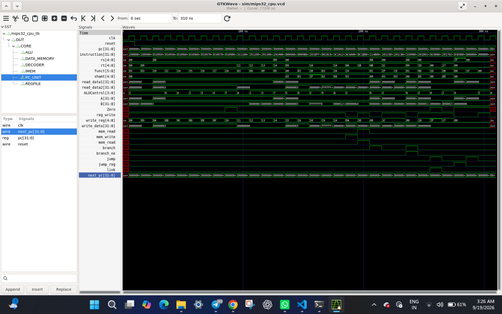

# MIPS32 Processor --- Verilog RTL

A modular 32-bit MIPS32 processor implemented in Verilog HDL and
verified using Icarus Verilog and GTKWave.

## Project Overview

This project implements a functional MIPS32 subset processor with: - 32
× 32-bit general-purpose registers - 32-bit Program Counter (PC) -
Instruction memory - Data memory - Arithmetic Logic Unit (ALU) -
Instruction decoder - Immediate extension logic - Branch and jump
control - Register write-back - Integrated CPU testbench - VCD waveform
generation - GTKWave-based signal verification

## Supported Instructions

### R-Type

ADD, SUB, AND, OR, XOR, NOR, SLT, SLL, SRL, SRA, JR

### Immediate

ADDI, ANDI, ORI, XORI, SLTI, LUI

### Memory

LW, SW

### Branch

BEQ, BNE

### Jump

J, JAL

## Repository Structure

``` text
MIPS32-Processor-Verilog/
├── rtl/
├── tb/
├── scripts/
├── archive/
├── docs/
├── sim/
├── .gitignore
└── README.md
```

## Tools

-   Verilog HDL
-   Icarus Verilog
-   GTKWave
-   Git
-   Ubuntu / WSL
-   Visual Studio Code

## Running the Simulation

``` bash
./scripts/run.sh
```

The simulation generates:

``` text
sim/mips32_cpu.vcd
```

## Viewing Waveforms

``` bash
gtkwave sim/mips32_cpu.vcd
```

## Verification

The integrated CPU testbench verifies:

``` text
PASS: ADD
PASS: SUB
PASS: AND
PASS: OR
PASS: XOR
PASS: SLT
PASS: ANDI
PASS: ORI
PASS: XORI
PASS: SLTI
PASS: SLL
PASS: SRL
PASS: SRA
PASS: LUI
PASS: LW/SW
PASS: BEQ
PASS: BNE
PASS: JAL/JR
PASS: JAL link register
```

## Verification Flow

``` text
Verilog RTL
     │
     ▼
Icarus Verilog
     │
     ▼
Simulation
     │
     ▼
VCD Waveform
     │
     ▼
GTKWave
```

## Future Extensions

-   Additional MIPS32 instructions
-   MULT / DIV and HI/LO registers
-   Exception handling
-   5-stage pipeline
-   Hazard detection and forwarding
-   Branch prediction
-   Instruction and data caches
-   Assembler support
-   FPGA implementation
-   Synthesis and timing analysis
-   RTL-to-GDSII flow

## GTKWave Verification

The MIPS32 processor was simulated using Icarus Verilog and the generated VCD waveform was analyzed using GTKWave.



## Author

**Suresh Kumar**

M.Tech --- Systems & Control Engineering\
IIT Bombay

## License

This project is intended for educational and research purposes.
